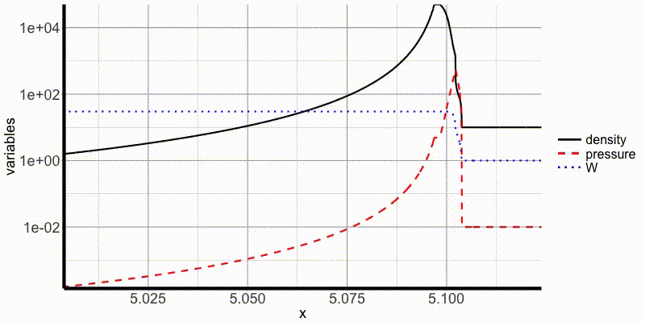
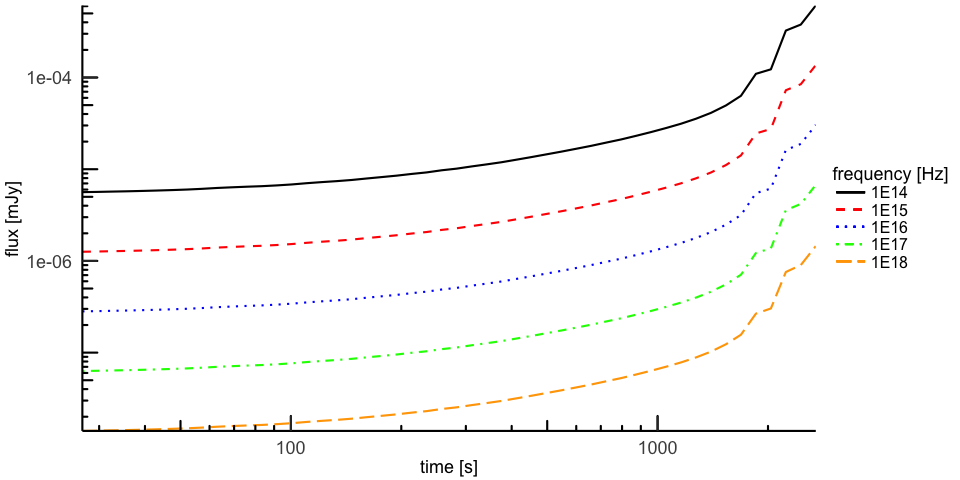

# Preprocessing examples

## `shprSPEV2`

This example shows how to use the shock detection preprocessor. The following files are needed:
- `shprSPEV2` compiled with the following command: `$ make -j OPENMP=1 AXIS=1 SPHERICAL=1 NATIVE=1 shprSPEV2`
- `example-00000.h5` input file (contains 100 snapshots)
- `prepro.params` parameter file

The hydro simulation in this example is a jet with E_ISO = 1E53 erg, with the constant luminosity lasting for 1000 seconds and decreasing as t^-3. The jet is propagating into an external medium with constant density 10 particles per cm^3. Here is a an animation:

The density is in units of cm^-3, and the pressure is measured in cm^-3 c^2. W is the fluid Lorentz factor. The distance x is measured in 10^16 cm.

The goal of this example is to detect the forward shock (FS) and to produce the emitting volumes that will be used to compute a light curve. In the parameter file `prepro.params` we specify the parameters `epsilon_e`, `zeta_e` and `epsilon_B` as usual. We also specify the parameter `prtr` which is the threshold for the shock detection. Finally, since this is a 1D simulation, we specify the `theta_j_min`, `theta_j_max` and `num_theta_j` to create a 2D coverage of the angular slice between `theta_j_min` and `theta_j_max` (radians) using `num_theta_j` particles. Finally, the parameter `labToffset` is the offset that is added to the laboratory (simulation) time to make the not simulated jet formation coincide with the beginnig of the observations. Typically, if the jet is propagating with the velocity beta_0 c at the start of the simulation, and if the jet is injected at the radius R_0, `labToffset` should be computed as R_0 / (beta_0). This should be expressed in the units specified by `length_norm` (**not** in seconds).

We use the following command to run the preprocessor:

`$ ./shprSPEV2 prepro.params example prep 0 0 50000 100000 10`

This tells `shprSPEV2` to read the files `example-00000.h5` through `example-00000.h5` (just one file in reality), and to store the results in the files `prep00000.h5`, `prep00001.h5` etc. (as needed). The block size is 50000, and there can be 100000 blocks in each output file. The first 10 snapshots will be skipped. In practice, this means we get only one output file in this example and it has 24 blocks. it can be used by the postprocessor to compute the light curves. The final argument tells `shprSPEV2` to skip first ten snapshots because of the (probable) numerical artefacts.

# Postprocessing examples

## `mshpoSPEV2`

We will use the file produced in the [`shprSPEV2`](./examp.md#shprspev2) example. The following files will be needed:
- `mshpoSPEV2` compiled with the following command: `$ make -j OPENMP=1 AXIS=1 SPHERICAL=1 NATIVE=1 mshpoSPEV2`
- `prep00000.h5` produced in the  [`shprSPEV2`](./examp.md#shprspev2) example
- `post.params` parameter file
- `uinterp.h5`: synchrotron interpolation table (get if from [this link](https://drive.google.com/open?id=1mYBBZbZXXfc4S-TDnKGT6vUOYpY_jJKt))
- `gauntff_merged_Z01.dat` from the SPEV2 source

We run the following command:
`$ ./mshpoSPEV2 post.params prep00000.h5 postp`

It indicates to `mshpoSPEV2` that it should read the parameters from `post.params` and then process the file `prep00000.h5` and write the results into `postp-thick.h5` and `postp-thin.h5` `VD` files. In the parameter file we specify that the source is at redshift 0.354.

# Converting examples

## `oaproch5`

We will use the file produced in the [`mshpoSPEV2`](./examp.md#mshpospev2) example. The following files will be needed:
- `oaproch5` compiled with the command: `$make -j NATIVE=1 oaproch5`
- `postp-thick.h5` produced in the [`mshpoSPEV2`](./examp.md#mshpospev2) example.

We invoke `oaproch5` with the following command:
`$ ./oaproch5 postp-thick.h5 lc.dat -1d0 1d16 1d0 1`

This indicates that all frequencies will be written and that the length normalization is `1E16 cm`. The time normalization is 1 second and the flux will be expressed in mJy. Here is the plot:

